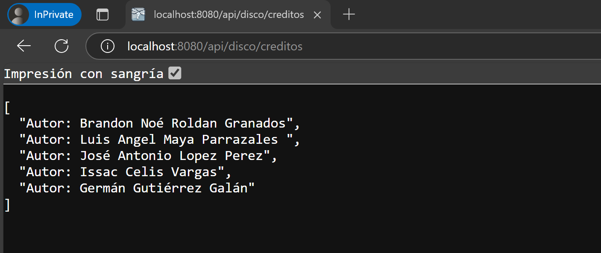

# Práctica (Participación)

Este proyecto demuestra el desarrollo de una **API REST** utilizando **Spring Boot**, donde se implementan los métodos **CRUD** sobre la entidad **Disco**.

## Entidad: Disco
La entidad **Disco** tiene los siguientes atributos:
- **id**: Identificador único del disco.
- **nombre**: Nombre del disco.
- **genero**: Género musical del disco.
- **codigo**: Código único asociado al disco.
- **anioLanzamiento**: Año en que se lanzó el disco.
- **compania**: Compañía discográfica que produjo el disco.

---

## Endpoints y Pruebas

### **GET: Obtener todos los discos**
- **URL:** `http://localhost:8080/api/disco/`
- **Descripción:** Obtiene una lista de todos los discos registrados en la base de datos.
- **Prueba:**

  

---

### **GET: Obtener un disco por ID**
- **URL:** `http://localhost:8080/api/disco/{id}`
- **Descripción:** Obtiene un disco específico según su `id`.
- **Ejemplo:** `http://localhost:8080/api/disco/1`
- **Prueba:**

  

---

### **POST: Añadir un nuevo disco**
- **URL:** `http://localhost:8080/api/disco/`
- **Descripción:** Crea un nuevo registro de disco con los datos proporcionados en el cuerpo de la solicitud.
- **Prueba:**

  

---

### **PUT: Actualizar un disco**
- **URL:** `http://localhost:8080/api/disco/{id}`
- **Descripción:** Actualiza un disco existente identificado por su `id`.
- **Ejemplo:** `http://localhost:8080/api/disco/21`
- **Prueba:**

  

---

### **DELETE: Eliminar un disco**
- **URL:** `http://localhost:8080/api/disco/{id}`
- **Descripción:** Elimina un disco existente según su `id`.
- **Ejemplo:** `http://localhost:8080/api/disco/21`
- **Prueba:**

  

---

### **Créditos: Información de los participantes**
- **URL:** `http://localhost:8080/api/disco/creditos`
- **Descripción:** Muestra información sobre los participantes o autores del proyecto.
- **Prueba:**

  

---

## Notas Finales

Este proyecto ejemplifica el uso básico de Spring Boot para construir y probar servicios REST. La implementación sigue el patrón CRUD (Create, Read, Update, Delete), con imágenes de pruebas realizadas con Postman.

---
